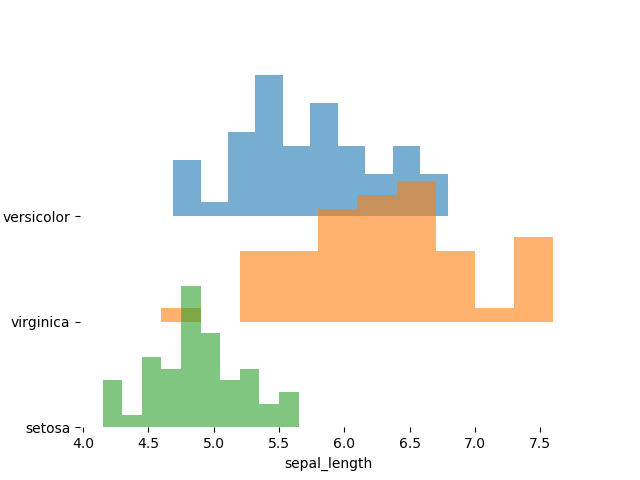

# pyjoy

A thin wrapper around Matplotlib for conveniently making '[joy plots](https://github.com/clauswilke/ggjoy)'. 



# Usage

Accepts a DataFrame as input, and can be used to make grouped line plots or histograms.

Install from PyPI, ```pip install pyjoyplot```

```

	Args:
		data (pd.DataFrame): DataFrame holding all data       -- required
		x (str)  : DataFrame column to use as x value         -- required
		y (str)  : DataFrame column to use as y values        -- required, if making a line plot
		hue (str): DataFrame column to use to group data      -- required
		kind (str): specify plot type; line or hist 	      -- default = line
		offset (int/float): vertical seperation between plots -- default = 0.75
		cmap (str/list): name of matplotlib cmap, or list     -- default = 'Dark2'
				 of colors to be used for plots
		smooth (int): smoothing window,                       -- default = 1 (no smoothing)
		order (list): order of categories - top to bottom     -- default = None 
		bins (int/list): bins if using hist. 
				 int for all hists to have same bins
				 else list of bin numbers	      -- default = 10

		return : ax object
```
