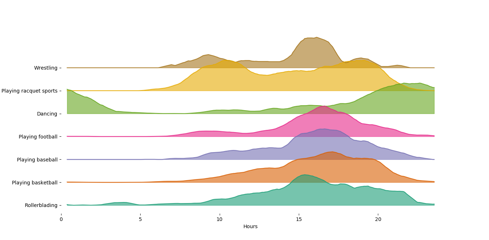

# pyjoy

A thin wrapper around Matplotlib for conveniently making '[joy plots](https://github.com/clauswilke/ggjoy)'. 


# Usage

Accepts a DataFrame as input, and can be used to make grouped line plots or histograms.
```

	Args:
		data (pd.DataFrame): DataFrame holding all data
		x (str)  : DataFrame column to use as x value
		y (str)  : DataFrame column to use as y values (if making a line plot) 
		hue (str): DataFrame column to use to group data
		kind (str): specify plot type; line or hist
		offset (int/float): vertical seperation between plots
		cmap (str/list): name of matplotlib cmap, or list
				 of colors to be used for plots
		smooth (int): smoothing window, if smoothing to be applied
		order (list): order of categories - top to bottom
		bins (int/list): bins if using hist. int for all hists to have same bins
				 else list of bin no. for each histogram
```
